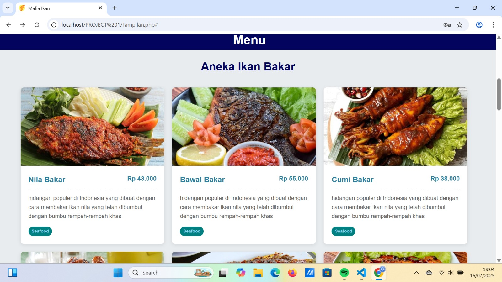

# 🐟 Mafia Ikan

Selamat datang di **Mafia Ikan**, sebuah proyek bertema laut, ikan, dan intrik di bawah ombak.

---

## 🌅 Halaman Utama Aplikasi



---

## 🌊 Tentang Proyek

**Mafia Ikan** adalah aplikasi/web sederhana bertema kehidupan bawah laut. Proyek ini dibuat oleh **Kelompok 1 Kelas X**, berisi fitur seperti login, pengelolaan pesanan, dan tampilan data.

## 🐠 Fitur

- Sistem login / logout  
- Halaman tampilan pesanan  
- CRUD pesanan ikan (buat, edit, simpan)  
- Struktur backend sederhana menggunakan PHP  
- (Tambahkan fitur lain jika diperlukan)


## 📁 Struktur Direktori

```bash
Mafia-Ikan/
├── img/ # Gambar tema laut / halaman utama
├── Koneksi.php
├── Login.php
├── Logout.php
├── Tampilan.php
├── coba.php
├── edit_pesanan.php
├── simpan_pesanan.php
└── testing.php
```
bash
Copy code

## 🚀 Cara Menjalankan

1. Clone repo:
   ```bash
   git clone https://github.com/dudi2009/Mafia-Ikan.git
Buka folder proyek:

bash
cd Mafia-Ikan
Siapkan database MySQL dan sesuaikan Koneksi.php

Jalankan melalui XAMPP / WAMP / LAMP

Akses via browser:
http://localhost/Mafia-Ikan/

👥 Kontribusi
Fork repository

Buat branch baru

Lakukan perubahan

Push & buat Pull Request

🐚 Lisensi
Mafia Ikan dirilis dengan lisensi MIT.
